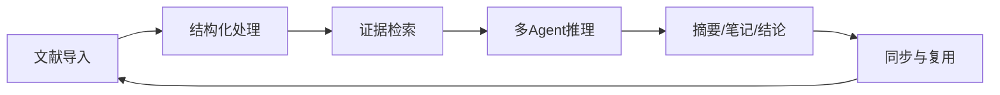
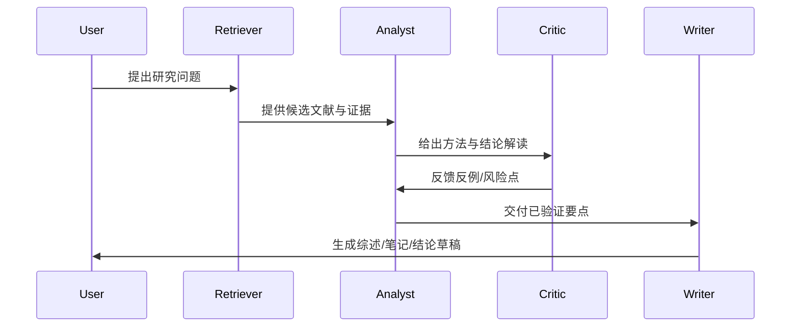
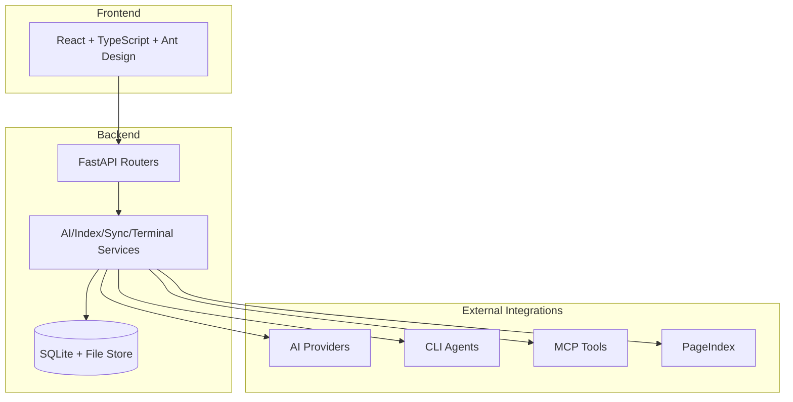

# AI4Research

<p align="center">
  
</p>

<p align="center">
  Open AI Research Hub for Papers: Claude Code + Gemini CLI + Codex + MCP Tools
</p>

<p align="center">
  <a href="https://img.shields.io/badge/Architecture-FastAPI%20%2B%20React-2563EB"></a>
  <a href="https://img.shields.io/badge/Integration-CLI%20%7C%20API%20%7C%20MCP-16A34A"></a>
  <a href="https://img.shields.io/badge/Mode-AI%20Agent%20Team-0EA5E9"></a>
  <a href="https://img.shields.io/badge/Scope-AI%20for%20Every%20File-7C3AED"></a>
</p>

> 主要负责人：王胜教授（[sheng.whu.edu.cn](https://sheng.whu.edu.cn)）及其博士、硕士研究生团队。

## 快速导航

- [项目定位](#项目定位)
- [核心理念](#核心理念)
- [研究闭环](#研究闭环)
- [开放接入](#开放接入)
- [AI 能力地图](#ai-能力地图)
- [Agent Team 工作方式](#agent-team-工作方式)
- [界面预览](#界面预览)
- [快速开始](#快速开始)
- [技术架构](#技术架构)
- [Roadmap](#roadmap)

## 项目定位

AI4Research 不是“论文阅读器 + 聊天框”，而是一个面向科研任务的 **Research OS（研究操作系统）**。

它关注的是：

1. 把分散的研究动作（检索、阅读、标注、推理、写作）连接成可复用流程。
2. 把 AI 从“临时助手”升级为“可编排、可协作、可审计”的研究基础设施。
3. 把研究文件从静态附件升级为可计算的上下文与证据来源。

## 核心理念

| 理念 | 一句话定义 | 系统落地 |
|---|---|---|
| Open Integration | 不绑定单一模型或单一 Agent | CLI / API / MCP 三层接入 |
| AI for Every File | 一切文件都是 AI 的可计算上下文 | PDF/Markdown/笔记/索引统一入流 |
| Agent Team | 研究任务由多角色协作完成 | Retriever/Analyst/Critic/Writer 角色化协同 |

> [!NOTE]
> 当前系统已具备 Agent 服务与工具编排基础；可视化 Agent Team 编排界面属于持续增强项（见 Roadmap）。

## 研究闭环



每一环都有可落地产物，而不是只留下聊天记录：

1. 结构化处理：Markdown、PageIndex 节点索引。
2. 证据检索：节点级召回与上下文拼装。
3. 多 Agent 推理：工具调用轨迹与中间结果。
4. 输出沉淀：摘要、注释、目录结构、引用关系。

## 开放接入

### 统一接入矩阵

| 层级 | 接口形式 | 当前可用形态 |
|---|---|---|
| 模型层 | API | OpenAI-compatible / Claude-compatible Provider |
| Agent 层 | CLI | Claude Code / Gemini CLI / Codex |
| 工具层 | MCP | MCP Tools 动态发现与调用 |

### 接入原则

1. 能通过 CLI 调用的 Agent，都可以纳入流程。
2. 能通过 API 提供推理能力的模型，都可以配置为 Provider。
3. 能通过 MCP 暴露能力的工具，都可以成为 Agent 的外部动作。

## AI 能力地图

| 阶段 | AI 能力 | 输入 | 输出 |
|---|---|---|---|
| 阅读 | 选区问答、上下文对话、翻译 | PDF 选区 + 文件上下文 | 可追溯回答 |
| 理解 | PageIndex 结构化检索 | 论文 Markdown + 索引节点 | 证据驱动解释 |
| 组织 | 自动目录提案、论文重分类 | 论文元数据 + 内容摘要 | 目录树与分类关系 |
| 生产 | 摘要生成、笔记沉淀 | 对话过程 + 文件证据 | 可复用研究资产 |
| 扩展 | Agent + MCP 工具协作 | 任务指令 + 工具能力 | 多步骤任务执行 |

## Agent Team 工作方式



推荐的最小团队配置：

1. Retriever：负责覆盖率。
2. Analyst：负责结构化解释。
3. Critic：负责有效性审查。
4. Writer：负责可交付输出。

## 界面预览

| 首页：论文与目录管理 | 阅读界面：PDF + AI 工具箱 |
|---|---|
|  |  |

| 自动目录与论文分类 | Claude Code 接入演示 |
|---|---|
|  |  |

## 快速开始

### 一键启动

Windows:

```bash
start.bat
```

Linux / macOS:

```bash
bash start.sh
```

### 手动启动

后端：

```bash
cd backend
pip install -r requirements.txt
python -m uvicorn main:app --host 0.0.0.0 --port 8000 --reload
```

前端：

```bash
cd frontend
npm install
npm run dev
```

访问：

- Frontend: `http://localhost:3000`
- Backend API: `http://localhost:8000/docs`

## 技术架构



## 安全说明

> [!WARNING]
> 开源发布前必须确认：

1. 不提交真实密钥（`.env`、数据库、日志、缓存）。
2. 不提交本地运行数据（例如 `backend/data/*.db*`、`backend/data/.fernet.key`）。
3. 使用 `.env.example` 作为公开模板。

## Roadmap

1. Agent Team 可视化编排（任务图 + 角色模板）。
2. 跨 Agent 共享记忆与证据缓存。
3. 统一连接器市场（MCP / CLI / API）。
4. 研究流程质量评估（质量、成本、时间）。

## 贡献

欢迎通过 Issue / PR 参与共建，优先方向：

1. 新模型与新 Agent 连接器。
2. 文件级检索与证据链增强。
3. 多 Agent 协作策略。
4. 阅读与交互体验优化。
