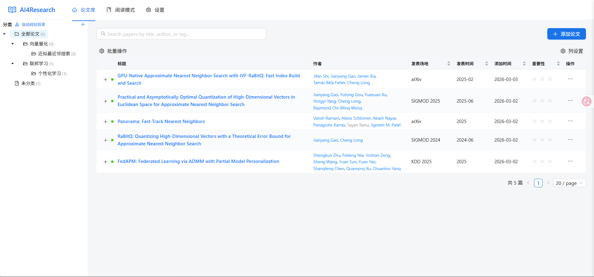
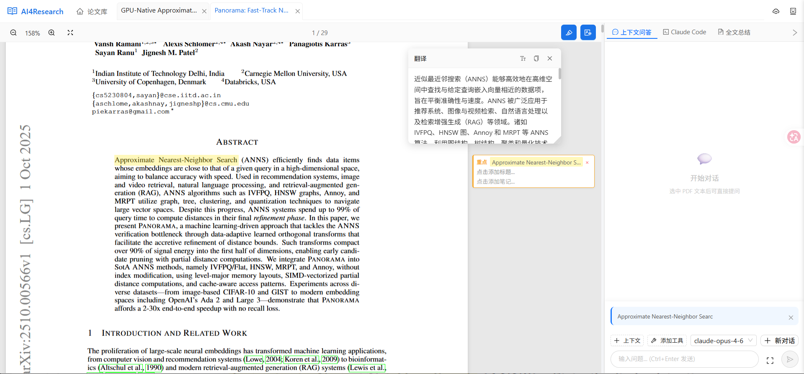
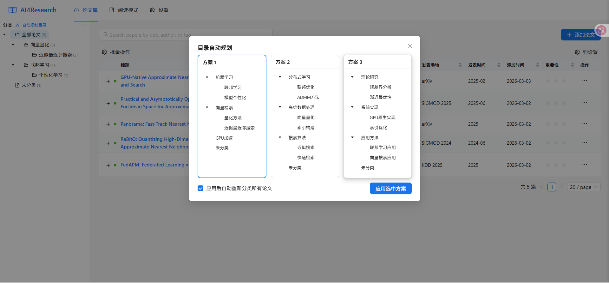
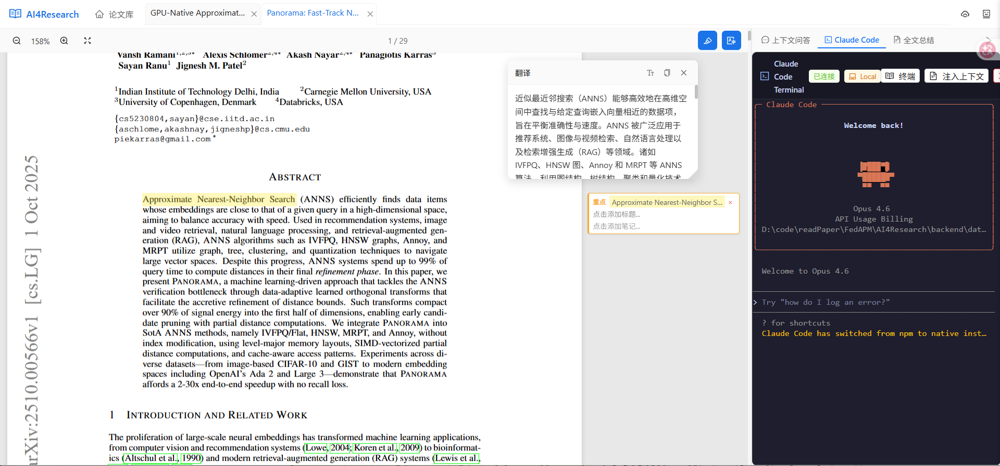

# AI4Research

> Open AI Research Hub for Papers: **Claude Code + Gemini CLI + Codex + MCP Tools**
> 主要负责人：王胜教授（[sheng.whu.edu.cn](https://sheng.whu.edu.cn)）及其博士、硕士研究生团队

AI4Research 是一个面向科研工作流的开放式 AI 中枢。  
它的目标不是做“单点聊天”，而是让 **模型、文件、工具、Agent** 在同一系统中协作，形成可持续迭代的研究生产线。


## 产品截图

| 首页（论文与目录） | 阅读界面（PDF + AI 工具箱） |
|---|---|
|  |  |

| 自动目录与论文分类 | Claude Code 接入演示 |
|---|---|
|  |  |

## 为什么是 AI4Research

| 维度 | 传统论文工具 | AI4Research |
|---|---|---|
| AI 能力 | 单轮问答 | 多模型 + 多工具 + 多 Agent 协作 |
| 文件处理 | 仅阅读/标注 | 一切文件皆可 AI 上下文 |
| 扩展方式 | 封闭插件 | 开放接入（CLI/API/MCP） |
| 推理依据 | 黑盒回答 | PageIndex 结构化证据链 |
| 工作流 | 手工串联 | 可编排、可复用、可迭代 |

## 核心理念

### 1. 开放接入（Open Integration）

不绑定单一模型、单一厂商、单一 Agent。  
只要可通过 CLI / API / MCP 接入，就可以进入统一研究流程。

可接入示例：
- Claude Code
- Gemini CLI
- Codex
- 其他 OpenAI-compatible / Claude-compatible Provider
- MCP 工具生态

### 2. 一切文件皆可 AI（AI for Every File）

在 AI4Research 中，文件不是附件，而是推理对象。

- PDF、Markdown、笔记、索引文件都可作为 AI 上下文
- 支持选区问答、跨文件补充上下文、基于证据的回答
- 支持 PageIndex 结构化检索，降低“无依据生成”风险

### 3. AI Agent Team（多智能体团队）

支持把研究任务拆为多角色协作，而不是单 Agent 串行执行。

典型角色：
- Retriever：检索论文与证据
- Analyst：归纳方法与实验
- Critic：反例检验与质量审查
- Writer：输出综述/笔记/结论草稿

说明：当前已具备 Agent 服务与工具编排基础，正在持续增强 Agent Team 的可视化编排能力。

## AI 功能总览

1. 上下文感知对话
- 基于论文内容、选中文本、匹配段落与附加文件进行推理回答

2. Agent + Tools 推理
- 在对话中动态调用 MCP 工具
- 支持工具优先级与服务级配置

3. PageIndex 结构化检索
- 为论文生成结构化索引
- 节点级证据召回 + 回答生成

4. AI 摘要与翻译
- 论文摘要流式生成与持久化
- 翻译 Provider 与 Prompt 可配置

5. AI 分类与目录提案
- 自动生成文件夹结构提案
- 支持批量重分类与应用

6. 作者与参考文献探索
- 作者画像、引用关系与相关工作延展

## 开放接入指南

### 模型接入

在 `Settings -> AI Providers` 中配置：
- Provider 类型（OpenAI / Claude）
- API URL
- API Key
- Model

### CLI Agent 接入（Claude Code / Gemini CLI / Codex）

典型方式：
1. 在运行环境安装对应 CLI
2. 通过内置终端与上下文注入让 Agent 读取项目文件
3. 与 MCP 工具和模型 Provider 组合成 Agent Team 工作流

## 快速开始

### 方式 A：一键启动

Windows:
```bash
start.bat
```

Linux / macOS:
```bash
bash start.sh
```

### 方式 B：手动启动

后端：
```bash
cd backend
pip install -r requirements.txt
python -m uvicorn main:app --host 0.0.0.0 --port 8000 --reload
```

前端：
```bash
cd frontend
npm install
npm run dev
```

访问：
- Frontend: `http://localhost:3000`
- Backend API: `http://localhost:8000/docs`

## 项目结构

```text
AI4Research/
├─ backend/
│  ├─ routers/               # papers/chat/settings/sync/terminal/...
│  ├─ services/              # AI、PageIndex、同步、终端、工具服务
│  ├─ templates/             # Prompt 模板
│  └─ data/                  # 本地运行数据（应忽略）
├─ frontend/
│  └─ src/
│     ├─ pages/              # Home / Reader / Settings
│     ├─ components/         # 阅读器、AI工具箱、目录树等
│     └─ api/                # 前端 API 封装
├─ docs/images/              # README 展示图片
├─ OtherProject/PageIndex/   # 结构化索引能力
└─ ClaudeCodeDocker/         # Claude Code 容器化支持
```

## 安全与开源发布建议

1. 不提交真实密钥
- `.env`、数据库、日志、缓存都要排查

2. 不提交本地运行数据
- `backend/data/*.db*`
- `backend/data/.fernet.key`

3. 使用示例配置
- 使用 `.env.example` 作为开源模板

## Roadmap

1. Agent Team 可视化编排（任务图 + 角色模板）
2. 跨 Agent 共享记忆与证据缓存
3. 统一连接器市场（MCP / CLI / API）
4. 研究流程质量评估（质量、成本、时间）

## 贡献

欢迎提交 Issue / PR，优先方向：
1. 新模型与新 Agent 连接器
2. 文件级检索与证据链增强
3. 多 Agent 协作策略
4. 阅读与交互体验优化


